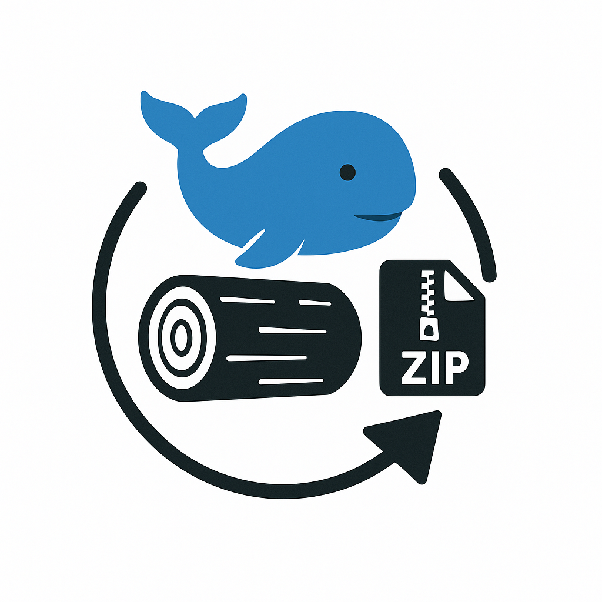

<p align="center">
  
</p>

# Docker Logrotate

[](https://github.com/samuelru/logrotate/actions/workflows/docker-publish.yml)
[](https://hub.docker.com/r/samuelrunggaldier/logrotate)

A Docker image that performs log rotation for other containers running in the same Docker Swarm environment.

## Overview

This container runs logrotate to manage log files from other containers in your Docker Swarm. It helps prevent log files from growing too large and consuming all available disk space. The container is designed to be lightweight and configurable through environment variables.

## Features

- Rotates log files from other containers in the same Docker Swarm
- Configurable rotation interval (daily, weekly, monthly, yearly)
- Configurable size-based rotation
- Configurable number of backup copies to keep
- Timezone support
- Automatic compression of rotated logs

## Usage

### Environment Variables

All environment variables are optional and have default values:

| Variable | Description | Default | Options |
|----------|-------------|---------|---------|
| `LOGS_PATH` | Path to log files to rotate | `/logs/*.log` | Any valid path pattern |
| `TRIGGER_INTERVAL` | How often to rotate logs | `daily` | `hourly`, `daily`, `weekly`, `monthly`, `yearly` |
| `MAX_SIZE` | Rotate if log file size reaches this threshold | `NONE` | `NONE` or size (e.g., `1K`, `10M`, `1G`) |
| `MAX_BACKUPS` | Number of backup copies to keep | `365` | Any positive integer |
| `DELAYCOMPRESS` | Delay compression of rotated logs until next rotation | `true` | `true`, `false` |
| `TZ` | Timezone | `UTC` | Any valid timezone (e.g., `Europe/Berlin`) |
| `SU_USER` | User for logrotate `su` directive (helps with bind mounts on Docker Desktop) | `root` | Any existing user inside container |
| `SU_GROUP` | Group for logrotate `su` directive | `root` | Any existing group inside container |

### Docker Compose Example

```yaml
version: '3.8'

services:
  # Example service that generates logs
  traefik:
    image: traefik:latest
    volumes:
      - /var/run/docker.sock:/var/run/docker.sock:ro
      - logs:/logs  # folder containing access.log file
    ports:
      - "80:80"
      - "443:443"
    command:
      - "--accesslog=true"
      - "--accesslog.filepath=/logs/access.log"
    deploy:
      restart_policy:
        condition: on-failure
        delay: 5s

  # Logrotate service
  logrotate:
    image: samuelrunggaldier/logrotate:latest  # Use latest version, or specify a version like 1.0.0
    volumes:
      - logs:/logs
    environment:
      TZ: "Europe/Berlin"
      LOGS_PATH: "/logs/*.log"
      TRIGGER_INTERVAL: daily
      MAX_SIZE: NONE
      MAX_BACKUPS: 365
      DELAYCOMPRESS: "true"
    deploy:
      restart_policy:
        condition: on-failure
        delay: 5s

volumes:
  logs:
    driver: local
```

### Run on Docker Desktop (Windows/macOS)

You can run this stack locally with Docker Desktop using Docker Compose. The included `docker-compose.yml` already contains an example app (Traefik) that writes logs for `logrotate` to rotate.

Steps:

1. Clone this repository or copy the `docker-compose.yml` into an empty folder.
2. From that folder, start the stack:
   ```bash
   docker compose up -d
   ```
3. Watch the `logrotate` container logs:
   ```bash
   docker compose logs -f logrotate
   ```
4. List rotated files (example uses the named volume `logs` mounted at `/logs`):
   ```bash
   docker compose exec logrotate sh -lc "ls -l /logs"
   ```
5. Stop and clean up when done:
   ```bash
   docker compose down -v
   ```

Notes for Windows/macOS:

- The provided compose file uses a named volume (`logs`), which works out-of-the-box on Docker Desktop. If you prefer a bind mount, use `./logs:/logs` and ensure the project folder is within a directory shared with Docker Desktop (Settings → Resources → File sharing).
- Timezone can be set via `TZ` (e.g., `Europe/Berlin`).
- You can change which files are rotated by adjusting `LOGS_PATH` (default `/logs/*.log`).
- If you use a bind mount (`./logs:/logs`) and see an error like: `error: skipping "/logs/*.log" because parent directory has insecure permissions (...) Set "su" directive in config file`, set `SU_USER` and `SU_GROUP` (e.g., `root`/`root`). This adds `su user group` to the logrotate config to handle Docker Desktop’s permissions semantics.

Run without Compose (optional):

```bash
docker run -d --name logrotate \
  -e TZ=UTC \
  -e LOGS_PATH="/logs/*.log" \
  -e TRIGGER_INTERVAL=daily \
  -e MAX_SIZE=NONE \
  -e MAX_BACKUPS=365 \
  -e SU_USER=root \
  -e SU_GROUP=root \
  -v logs:/logs \
  samuelrunggaldier/logrotate:latest
```

### Deployment

To deploy the stack to a Docker Swarm:

```bash
docker stack deploy -c docker-compose.yml mystack
```

## Common Configurations

### Daily Rotation with Size Limit

```yaml
logrotate:
  image: samuelrunggaldier/logrotate:latest
  volumes:
    - logs:/logs
  environment:
    TRIGGER_INTERVAL: daily
    MAX_SIZE: 100M
    MAX_BACKUPS: 30
```

### Weekly Rotation

```yaml
logrotate:
  image: samuelrunggaldier/logrotate:latest
  volumes:
    - logs:/logs
  environment:
    TRIGGER_INTERVAL: weekly
    MAX_BACKUPS: 52
```

### Rotating Specific Log Files

```yaml
logrotate:
  image: samuelrunggaldier/logrotate:latest
  volumes:
    - logs:/logs
  environment:
    LOGS_PATH: "/logs/app-*.log"
```

### With Delayed Compression

```yaml
logrotate:
  image: samuelrunggaldier/logrotate:latest
  volumes:
    - logs:/logs
  environment:
    TRIGGER_INTERVAL: daily
    MAX_BACKUPS: 30
    DELAYCOMPRESS: "true"
```

## Building the Image

### Local Build

To build the Docker image locally:

```bash
docker build -t samuelrunggaldier/logrotate:latest .
```

### CI/CD Pipeline

This project uses GitHub Actions for continuous integration and delivery:

1. **Automated Builds**: Every push to the main branch and pull request triggers an automated build.
2. **Versioned Releases**: Creating a tag with the format `v*` (e.g., `v1.0.0`) triggers a versioned release.
3. **Monthly Updates**: The image is automatically rebuilt and published on the first day of each month to ensure it stays up-to-date.
4. **Docker Hub Publishing**: Successfully built images are automatically published to [Docker Hub](https://hub.docker.com/r/samuelrunggaldier/logrotate).

### Versioning Strategy

The Docker images follow semantic versioning:

| Tag Format | Example | Description |
|------------|---------|-------------|
| `latest` | `samuelrunggaldier/logrotate:latest` | Latest stable build from the main branch (updated monthly) |
| `{version}` | `samuelrunggaldier/logrotate:1.2.3` | Specific version (from git tag v1.2.3) |
| `{major}.{minor}` | `samuelrunggaldier/logrotate:1.2` | Latest patch version of a specific minor version |
| `{major}` | `samuelrunggaldier/logrotate:1` | Latest minor.patch version of a specific major version |
| `main` | `samuelrunggaldier/logrotate:main` | Latest build from the main branch (same as latest, updated monthly) |
| `sha-{commit}` | `samuelrunggaldier/logrotate:sha-a1b2c3d` | Build from a specific commit |

To use a specific version in your docker-compose.yml, choose one of these options:

```yaml
# Option 1: Use a specific version
logrotate:
  image: samuelrunggaldier/logrotate:1.0.0
```

```yaml
# Option 2: Use latest 1.x.x version
logrotate:
  image: samuelrunggaldier/logrotate:1
```

```yaml
# Option 3: Use latest version
logrotate:
  image: samuelrunggaldier/logrotate:latest
```

## Troubleshooting

### Logs Not Rotating

1. Check that the log files match the pattern specified in `LOGS_PATH`
2. Verify that the container has proper permissions to access the log files
3. Check the container logs for any errors:
   ```bash
   docker service logs mystack_logrotate
   ```

### Container Exiting Unexpectedly

1. Check that the cron daemon is running properly
2. Verify that the logrotate configuration is valid
3. Check system resources (memory, disk space)

### "Destination Already Exists" Error

If you see errors like `error: destination /logs/access.log-YYYYMMDD already exists, skipping rotation`:

1. This is fixed in the latest version by using a more precise timestamp format that includes hours, minutes, and seconds
2. If using an older version, you can work around this by:
   - Manually removing the existing rotated log files
   - Restarting the logrotate container
   - Scheduling the container to run at different times than when logs are created

## License

This project is licensed under the MIT License - see the [LICENSE](LICENSE) file for details.

## Third-Party Components

This project uses the following third-party components:

- [Alpine Linux](https://alpinelinux.org/) - Licensed under [GNU General Public License](https://www.gnu.org/licenses/gpl-3.0.en.html)
- [logrotate](https://github.com/logrotate/logrotate) - Licensed under [GNU General Public License v2](https://www.gnu.org/licenses/old-licenses/gpl-2.0.en.html)
- [tzdata](https://www.iana.org/time-zones) - Public Domain
- [bash](https://www.gnu.org/software/bash/) - Licensed under [GNU General Public License v3](https://www.gnu.org/licenses/gpl-3.0.en.html)
- [coreutils](https://www.gnu.org/software/coreutils/) - Licensed under [GNU General Public License v3](https://www.gnu.org/licenses/gpl-3.0.en.html)
- [findutils](https://www.gnu.org/software/findutils/) - Licensed under [GNU General Public License v3](https://www.gnu.org/licenses/gpl-3.0.en.html)
- [grep](https://www.gnu.org/software/grep/) - Licensed under [GNU General Public License v3](https://www.gnu.org/licenses/gpl-3.0.en.html)
- [Traefik](https://traefik.io/) (in example configuration) - Licensed under [MIT License](https://github.com/traefik/traefik/blob/master/LICENSE.md)

## Contributing

Contributions are welcome! Please feel free to submit a Pull Request.

By contributing to this project, you agree that your contributions will be licensed under the project's MIT License.